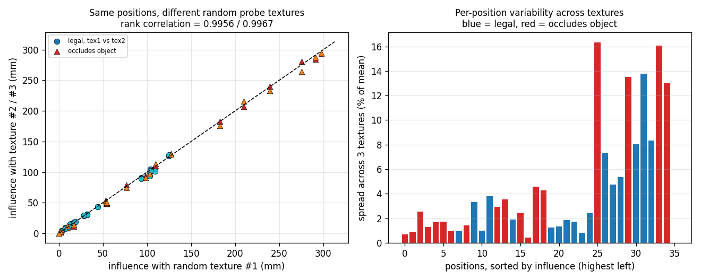
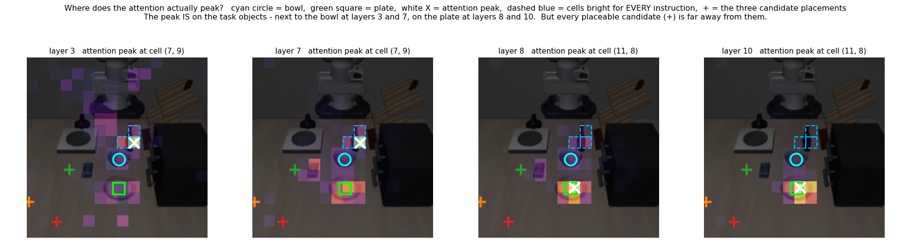
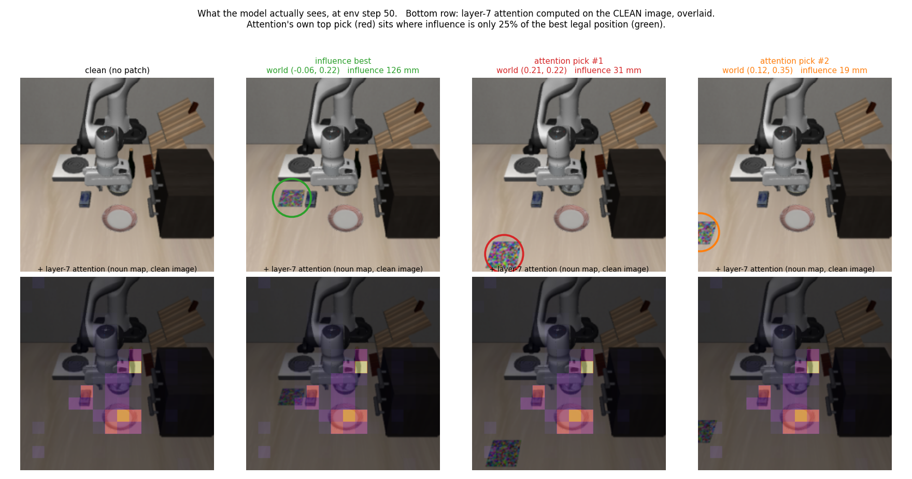
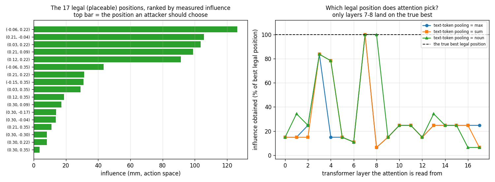
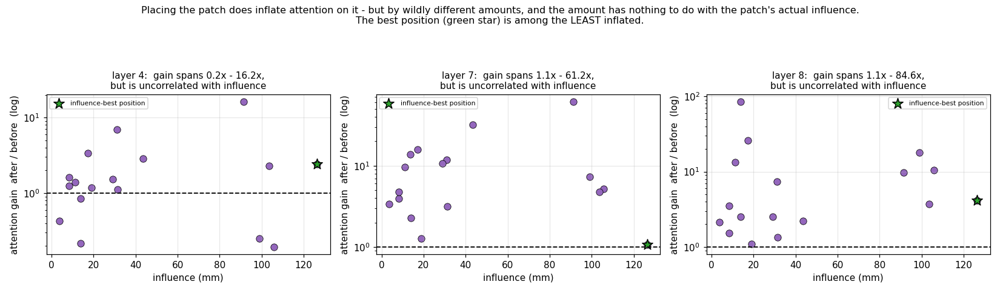
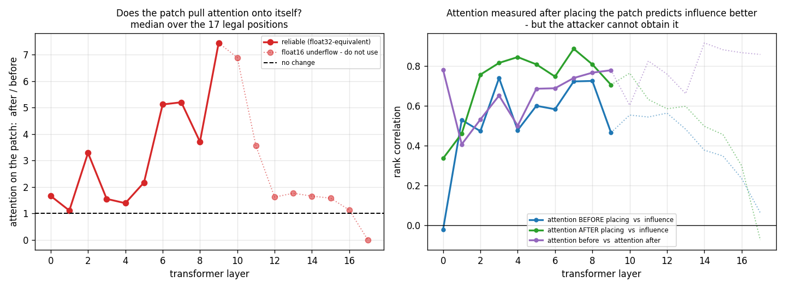

# 实验结果逐项总结

**对象**:π0.5 机器人策略(openpi 的 `pi05_libero` 权重,PyTorch 版)
**环境**:LIBERO-Goal 桌面场景,指令 `put the bowl on the plate`(把碗放到盘子上)
**日期**:2026-08-12(2026-08-11 那版的主结论已被视角消融推翻,见「一句话结论」与第 3.5 节)

**要回答的总问题**:
想在桌面上贴一张对抗贴纸来干扰机器人。贴哪里最有效?
有人提出用 attention 来选位置(输入指令和图像,看模型注意力落在哪,就贴那里)。
**这个方法选出来的位置,是不是真正影响最大的位置?**

所有位置一律用**世界坐标 (x, y)** 表示,单位米,桌面高度 z = 0.900。
碗在 (−0.098, −0.009),盘子在 (0.062, −0.009)。

---

## 一句话结论

**用 attention 选贴纸位置,成败完全取决于读哪一路相机、哪几层 —— 而这两个选择都需要事先知道答案。**

消融实测:**主视角(固定俯瞰相机)可以整个扔掉**,任务仍 15/15 成功,只慢 19%;
**腕部相机的 value 削到 0.1 倍,任务 0/15,完全做不成**。承重的是腕部。

而我先前所有 attention 分析读的都是主视角 —— 那个可以扔掉的。换到腕部重算后:

| | 主视角(可丢弃) | **腕部(承重)** |
|---|---|---|
| 第 3–8 层的首选拿到影响力 | 84% | **100%(直接命中)** |
| 108 种配置的命中率 | 8% | **35%** |
| 108 种配置拿到均值 | 32%(≈随机 35%) | **52%(优于随机)** |
| 逐层命中 100% 的层数 | 2 | **6** |

**所以"attention 找不到正确位置"是错的 —— 在承重视角上它直接找到了。**

**但有一条没变,而且是现在的核心限制:没有任何免费办法能确定该读第几层。**
三条无监督准则(最低熵 / 最尖峰 / 跨帧最稳定)在两个视角下**都选中第 0 层**,
拿到 11–15%;全 18 层平均也是 15% —— 都低于随机(35%)。

⚠️ **2026-08-17 加密扫描 + 固定-ε rollout 大改了三件事**(详见 §6、§11.5、§15.1,更正表见
`CONCLUSIONS.md` §E):
1. **面积不是决定性因素、位置才是** —— 旧的"面积↔influence +0.83"是只有 17 个合法点、
   且全落在 ≥15 cm 的采样假象;补到 78 点后相关塌到 +0.08、控制距离偏相关 **−0.48**。
2. **合法区天花板 ×2.44**(126→308 mm),加密最强点 #1003 超过原以为够不到的全局峰值;
   由此"主视角选不对、腕部选得对"也反转了(主视角 78 点池命中 35.2%、锁 #1003)。
3. **位置对轨迹偏移有可测后果**:固定 ε 把噪声地板归零后,偏移严格随 influence(秩相关 +1.00),
   峰值 67 mm;成功率仍全 100%(闭环把随机扰动修回),要掉成功率仍需优化贴纸。

---

## 0. 三个术语先说清楚

**「影响力地图」的每一格是什么**
每一格 = **把贴纸的中心放在那个世界坐标**,然后测模型输出的动作变了多少。
不是"图像上哪块区域重要",而是"贴纸放在这个物理位置的效果"。
6×6 = 36 格,覆盖 x ∈ [−0.15, 0.30]、y ∈ [−0.30, 0.35],格间距 9 cm。

**「旋转的测地距离」**
动作里的 3 维旋转是 axis-angle 表示,**不能直接相减** —— 同一个姿态有多种数值写法
(绕 x 转 359° 和转 −1° 是同一个姿态,数值却差 360)。测地距离是:

```
角度 = ‖ log(R₁⁻¹ R₂) ‖        从 R₁ 转到 R₂ 最少要转多少弧度
```
永远落在 0 到 π 之间,没有表示歧义。

**「秩相关」(Spearman)**
只看排名、不看数值大小:

```
36 个位置按影响力排 → 名次表 A
36 个位置按 attention 分数排 → 名次表 B
秩相关 = 这两串名次的相关系数
1.0 = 排名完全一致    0 = 毫无关系    −1 = 完全相反
```
用它而不用普通相关,是因为我们只关心"哪个位置更值得贴",不关心数值成比例。

---

## 1. 模型在干净环境下能不能做成这个任务

**怎么做**:跑 openpi 官方的 LIBERO 评测脚本,用官方成功判据。10 个任务,每个任务 3 次。

**比什么**:我转换出的 PyTorch 权重 vs 官方原版 JAX 权重,确认转换没转坏。

**结果**:

| 后端 | 总成功率 |
|---|---|
| 官方 JAX | 29/30 = 96.7% |
| 我的 PyTorch(后续全部实验都用它) | 28/30 = 93.3% |

逐任务只有两个不是满分:`open the middle drawer of the cabinet` 和 `put the bowl on top of the cabinet`,都是 2/3。
**我们要用的 `put the bowl on the plate` 是 3/3。**

**结论**:环境、权重、PyTorch 转换都正确;选的这条指令不存在"本来就做不成"的问题。

**限制**:每任务只跑 3 次,统计意义很弱(0.67 和 1.00 的差别就是 1 次)。官方跑 50 次。

**视频**:`out/videos/libero_goal_torch/rollout_put_the_bowl_on_the_plate_success.mp4`
(同目录下有全部 10 个任务的成功/失败视频)

---

## 2. 贴纸是不是真的 3D 物体(而不是在图上叠个矩形)

这一步是必须的,因为如果只是在渲染出来的图片上叠一个矩形,那它**永远不会被机械臂挡住、永远不会随视角变形、像素面积永远不变** —— 而这三样恰恰是要研究的东西。

**怎么做**:在 MuJoCo 场景编译前注入一个 10cm × 10cm × 1mm 的薄长方体,关闭碰撞(只可见、不参与物理),然后做四项检查。

| 检查 | 怎么做 | 结果 |
|---|---|---|
| 是真 geom | 数场景里的 geom 数量,并确认原有物体编号没被打乱 | 240 → 241,原 `table_collision` 编号不变(都是 7);贴纸拿到独立编号 240,可见 1032 像素 ✅ |
| **真的会被遮挡** | 把贴纸放在机械臂路径正下方,回放整条轨迹,数每帧可见像素 | 622 → **0**(第 15 帧完全被挡住)✅ |
| **真的会透视变形** | 把贴纸顶面 4 个世界角投影到相机,看是不是梯形 | 上边 44.85px、下边 43.42px,比值 1.033(矩形应为 1.000);近处投影 1791 px² vs 远处 876 px² ✅ |
| 纹理没被抹平 | 放在最远的位置,裁出来放大 | 875 个可见像素里有 875 种唯一颜色,色块结构完整 ✅ |

**结论**:四项全过。贴纸是真的场景 3D 物体,会被遮挡、会透视变形。

**图**:
- `out/findings/s1_check1_clean.png` / `s1_check1_patched.png` / `s1_check1_patchseg.png` —— 贴前/贴后/分割掩码
- `out/findings/s1_check2_occlusion_curve.png` —— **遮挡曲线(可见像素 622→0)**
- `out/findings/s1_check2_frames_maxmin.png` —— 最亮帧 vs 完全被挡的帧
- `out/findings/s1_check3_perspective_quad.png` —— 透视梯形
- `out/findings/s1_check4_texture_crop.png` —— 远距离纹理裁剪


---

## 3. 测量本身有没有随机性

**为什么要查**:π0.5 的动作是用 flow matching 生成的,要先采一个随机噪声。如果每次噪声不同,那"贴了贴纸后动作变了"这件事就分不清是贴纸造成的还是换了噪声造成的。

**怎么做**:同一张图、同一个噪声,连续前向两次,比结果。

**结果**:两次结果**逐位完全相同**(最大差值 = 0.000000)。

**结论**:噪声可以显式指定。所以后面所有测量都让"贴纸前"和"贴纸后"用**同一个噪声** ⇒
两者之差是精确量,不含任何测量噪声。这一点很重要:它意味着**位置之间的排序是精确的**,
不需要做显著性检验。

---

## 3.5 【最重要】哪一路相机是承重的 —— 主视角可以整个扔掉

**为什么要查**:模型同时吃两路图 —— 固定俯瞰的 `agentview`(下称主视角)和跟着夹爪走的
`robot0_eye_in_hand`(腕部)。所有 attention 分析都得选一路来读。我一开始默认读主视角,
但从没验证过哪一路真正决定动作。

**怎么做**:不涂黑图像(那会改变输入分布),而是在 paligemma **每一层的 `v_proj` 输出上**,
把某一路 image token 的 value 向量整体缩放。KV 序列布局:

```
968 = 3×256 图像 token + 200 文本 token
  [  0,256) 主视角        [256,512) 腕部
  [512,768) 第三路(LIBERO 只有两路,补位)   [768,968) 文本
```

自检:hook 每次 infer 触发 18 次(= 18 层),确认生效。

**结果**(同一批官方 init_state):

| 条件 | 成功率 | 平均成功步数 |
|---|---|---|
| `scale = 1.0` 对照(同一份代码) | 8/8 = 100% | 83 |
| **腕部 value ×0.1** | **0/15 = 0%** | — |
| 主视角 value ×0.1 | 8/8 = 100% | 101 |
| **主视角 value ×0.0(完全去掉)** | **15/15 = 100%** | 99 |

**结论:π0.5 在这个任务上几乎只靠腕部相机。** 主视角完全去掉仍 100% 成功,只慢 19%。

第二条独立证据:文本 token 分给两路的**注意力质量**,腕部占 **68.3%**(全 18 层合计),
18 层里有 17 层腕部占比 > 49%。

**多出来的那 16 步花在哪** —— 不是在找盘子:

| 条件 | 接近段 | 搬运段 | 总步数 | 末端总行程 |
|---|---|---|---|---|
| 主视角正常 | 40.6 | 35.6 | 86.2 | 700 mm |
| 主视角置 0 | 49.8 | 42.2 | 102.0 | **704 mm** |
| 增量 | +9.1(+22%) | +6.6(+19%) | +15.8 | **+4 mm** |

两段**等比例**变慢,而**末端总行程几乎不变**(+0.6%)。如果是在搜索目的地,应该出现绕路、
行程明显变长,而且增量该集中在搬运段。实际是**走的路一样长、只是每步挪得更小** ——
更像少了一路证据后的保守化,不是搜索。

⚠️ n=8,只报均值未做显著性;但"两段都增"和"行程不变"这两条不依赖两段之间的比较。

**数据**:`out/wrist_scaled_01.txt` / `out/base_zero.txt` / `out/wrist_scale1_control.txt` /
`out/phase_timing.txt`;脚本 `serve_policy_scaled.py`(缩放 server)+ `phase_timing.py`。

---

## 4. 哪个位置的影响最大(影响力地图)

**怎么做**(这是全部后续分析的基础):

```
先跑一条成功的干净轨迹(89 步),在每个决策点存一帧 → 共 16 帧
在桌面上撒 6×6 = 36 个候选位置
for 每一帧:
    记下干净情况下模型输出的动作
    for 36 个位置:
        把贴纸放在这个位置,重新渲染这一帧,再让模型输出一次动作
        两者之差 = 这个位置在这一帧的影响
```

**关键**:贴纸造成的动作**一次都没有被执行**,机器人从头到尾走的是干净轨迹。
这是"反事实查询" —— 只问"如果贴纸在这里,模型这一帧会怎么想",不让它真的走偏。
否则 36 个位置要跑 36 条轨迹,而轨迹一分叉后面看到的画面就全不同了,就分不清
是贴纸的作用还是"因为走到别处所以看到的不一样"。

**动作分三类分别算,绝不混在一起求平均**(平移是米、旋转是弧度、夹爪近似开关,量纲不同):

- 平移:三个轴合成长度
- 旋转:旋转之间的测地距离(不是直接相减欧拉角)
- 夹爪:开合状态是否翻转

**每帧的偏移再用两种方式沿 16 帧汇总**:

| 方式 | 算法 | 含义 |
|---|---|---|
| 总量式 | 每帧偏移长度累加 | 不管方向。先往左推再往右推,和一直往左推,得分一样 |
| 净向式 | 每帧偏移向量先相加,最后取长度 | 只剩下"每帧都朝同一方向"的部分 = 末端真正会漂多少的一阶估计 |

**结论**:两种汇总方式给出的**排名几乎一样**(秩相关 0.955,前 5 名相同),所以汇总方式的选择
不影响"该贴哪里"。影响力最高的位置全部集中在碗和盘子附近那一条带上。

**图**:
- `out/s2b_heat_trans_magnitude.png` —— **平移影响力地图(总量式)**
- `out/s2b_heat_trans_systematic.png` —— 平移影响力地图(净向式)
- `out/s2b_heat_rot_systematic.png` —— 旋转影响力地图
- `out/s2b_heat_gripper_flips.png` —— 夹爪翻转地图
- `out/s2b_heat_trans_coherence.png` —— 方向一致性地图(见下)


> ⚠️ 方向一致性地图**左下角的亮块是假的**:那几格影响力本身只有 2 mm 左右,
> 一致性是两个很小的数相除,没有意义。读这张图必须先按影响力大小过滤。

---

## 5. 影响集中在轨迹的哪个阶段

**怎么做**:上一节的数据本来就是逐帧的,直接按帧展开看。

**结果**:

| 帧(环境步) | 阶段(看夹爪开合) | 这段手臂实际移动 | 影响力最大值 |
|---|---|---|---|
| 步 10 | 刚开始,几乎不动 | 8 mm | 低 |
| 步 15–40 | 张开,接近碗 | 39–66 mm | 中–高 |
| **步 45–55** | **夹爪合拢(抓取)** | 5.6–31 mm | **几乎为零** |
| 步 60–85 | 闭合,搬运 | 47–64 mm | **最高峰(步 60 和 75)** |

**结论**:手臂动得快的时候影响大,**抓取那几帧几乎完全不受影响**。
一个可能的解释是抓取时输出已由机械臂自身状态主导,而移动时方向还在从画面现算 ——
但这只是观察,没有验证过。

**图**:`out/s2b_frame_profile.png` —— 逐帧影响力曲线,黑虚线是参照水平


⚠️ **松手的动作没被采到**:最后一帧是环境步 85,那时夹爪还是闭合的,任务在步 89 才成功。
松手发生在最后一批动作的执行过程中,不是决策点,所以 16 帧里夹爪从未重新张开。

---

## 6. 影响力是不是只是在测"贴纸看起来有多大"

**为什么要查**:远处的贴纸在画面里只有几十个像素,近处有一千多。如果影响力只是跟着像素面积走,
那这张地图就没测到"位置"这件事,只测到了"离相机多近"。

**怎么做**:统计每个位置贴纸的可见像素数(用分割掩码),和影响力比。

**结果**:

```
可见像素与影响力的相关 = 0.24（弱）

(0.21, 0.09)  可见 1366 像素 → 影响力 63.6 mm
(0.21,-0.04)  可见 1369 像素 → 影响力 49.0 mm
(-0.06,0.09)  可见  468 像素 → 影响力 145.3 mm   ← 面积小 3 倍,影响力大 2 倍多
```

> 📌 **这条结论翻过来又翻回去了(2026-08-17 定论)。**
> 曾经:0.24 是皮尔逊,换秩相关在 17 个合法点内是 +0.83,于是"撤回"了"面积不决定"这句。
> 但那个 +0.83 是**只有 17 个合法点、且全落在离物体 ≥15 cm** 的采样假象 —— 那一段里
> "离物体近"的合法格恰好也是"投影面积大"的格,面积只是距离的影子。
>
> 加密扫描把候选补到 **78 个合法点**后:
> - 面积 ↔ influence 秩相关从 +0.85 **塌到 +0.08**;
> - **控制距离后的偏相关 = −0.48(转负)**;控制面积后 距离↔influence = **+0.85**;
> - 面积配对:#1006(978 px,307 mm)vs #1055(977 px,102 mm)—— 面积一样,influence 差 3.0×;
> - 全池最强的 #1003 面积 872 px(**最小**),面积最大的 #16(1369 px)只排第 35。
>
> **最终结论:面积不是决定性因素,位置才是。** 「面积是影响力的强预测量」这句**再撤回**。
> 行为层佐证见 §15.1(固定-ε rollout:面积配对偏移差 2.22×)。

---

## 7. 换一张随机贴纸,位置排名会不会变

**为什么这是最关键的验证**:现在用的是一张固定的随机色块图。如果换一张随机图排名就变了,
那这张影响力地图测的是"这一张噪声图的性质",不是"位置的性质",后面拿它跟 attention 比就毫无意义。

**怎么做**:只改随机种子(色块大小 12 像素、饱和度都不变),生成 3 张统计性质完全相同的随机贴纸,
在**同一批 36 个位置**上各扫一遍。

**结果**:

| 比较 | 第1张 vs 第2张 | 第1张 vs 第3张 | 第2张 vs 第3张 |
|---|---|---|---|
| 排名秩相关(总量式) | 0.9956 | 0.9967 | 0.9956 |
| 排名秩相关(净向式) | 0.9897 | 0.9856 | 0.9894 |
| **前 5 名重合度** | **完全相同** | **完全相同** | **完全相同** |

三张贴纸各自独立算出来的前 5 名是**同一批位置**,逐位置的数值波动 ≤ 1%。

**结论**:**影响力排名是位置的性质,与具体用哪张随机贴纸无关。** 排名分辨率非常高。
后面所有和 attention 的比较,都用**三张贴纸的平均值**。

**图**:`out/fig_texture_consistency.png` —— 左:三张贴纸的影响力散点(全部贴在对角线上);
右:逐位置的跨贴纸波动(几乎全部低于 2%)



> 📌 这里纠正一个我之前的错误:我曾用"影响力有没有超过换噪声造成的动作抖动"当作
> 能不能排序的门槛。那是错的 —— 那个门槛回答的是"**随机贴纸自己能不能攻击成功**"
> (答案:不能,得靠优化过的贴纸,那是下一步),和"**能不能给位置排序**"是两个问题。
> 排序的正确门槛就是本节这个:换随机贴纸排名稳不稳。

---

## 8. attention 和影响力的排名相关吗(全部 36 个位置)

**怎么做**:

1. 用 forward hook 抓出"文本词 → 图像小块"的注意力(模型把 224×224 的图切成 16×16 = 256 个小块)
2. 按论文做法先对 8 个注意力头求和,再在图像小块上重新归一化(否则注意力质量会塌到起始符上)
3. 三种"把多个文本词合成一张图"的方式都做:逐词取最大(论文原版)/ 全词求和 / 只用名词
4. **18 层全部扫一遍**,不挑层
5. 每个候选位置的 attention 分数 = 这张贴纸在图里**实际覆盖到的那些小块**上的注意力平均值

**贴纸覆盖了哪些小块是怎么定的**:直接把贴纸前后的输入图相减,差值大的像素就是贴纸 ——
零几何假设,而且自动包含了被机械臂挡住的部分。
**验证**:这样得到的像素数与分割掩码给的可见像素数相关 **0.9984** ✅

**结果**(对三张贴纸平均后的影响力):

| 文本词合成方式 | 最好的层 | 排名秩相关 | 前 5 名重合度 |
|---|---|---|---|
| 逐词取最大(论文原版) | 第 3 层 | 0.808 | **0.250** |
| 全词求和 | 第 4 层 | 0.827 | 0.429 |
| 只用名词 | 第 7 层 | **0.884** | 0.429 |

**结论**:全局排名**高度相关**(0.81–0.88)。但**前 5 名只重合 2–3 个** ——
整体趋势像,头部换掉了。而只贴一张贴纸时,头部才是唯一要紧的。

**图**:`out/b4_attn_vs_influence.png` —— 左:逐层秩相关曲线(第 0 层几乎为 0,中间层最高);
右:散点图,蓝点是合法位置、红点是压住物体的位置


> 📌 纠正:我一开始报的是 0.877,那是在**没有重新归一化**的注意力上算的(违反规范)。
> 归一化后论文原版那一路掉到 0.808,前 5 名重合度从 0.429 腰斩到 0.250。
> 只用名词那一路对归一化完全不敏感(0.8837 → 0.8840),因为名词是固定的词集合,
> 归一化只是乘一个公共常数。

---

## 9. 这个相关会不会只是因为"两者都盯着物体"

**为什么要查**:attention 高的地方在物体附近,影响力高的地方也在物体附近。
那 0.88 可能只是说"两者都跟着物体走",而不是"attention 能预测影响力"。

**怎么做**:算一个**完全不需要模型**的基线 —— 每个位置到碗/盘子的最近距离,
然后看它自己能不能预测影响力;再用统计方法把这个因素扣掉。

**结果**:

| 比较 | 秩相关 |
|---|---|
| (−到物体的距离) vs 影响力 | **0.873** |
| (−到物体的距离) vs attention | 0.838 |
| attention vs 影响力 | 0.877 |
| **扣掉距离因素后的 attention vs 影响力** | **0.564** |

**结论**:一半多的相关来自"两者都在物体附近"。而且 ——
**一条不需要跑模型的免费几何规则(离任务物体越近越好)在全局排名上和 attention 打平**
(0.873 vs 0.877)。所以 attention 在全局排名这件事上,没有赢过一条平凡的基线。

---

## 10. attention 的高值会不会只是那个"永远亮的格子"

**为什么要查**:transformer 有个已知现象叫 attention sink —— 有几个固定位置不管输入是什么都很亮,
是模型内部的"寄存器",不代表真的在看那里。如果 attention 分数高只是因为贴纸压到了这种格子,
那 0.88 就完全是假的。

**怎么做**:
1. 用 9 条不同指令各算一张注意力图,各自归一化后**取最小值** —— 对每一条指令都亮的格子就是 sink
2. 把这些格子屏蔽掉(置零),重算相关

**结果**:

sink 格子被定位在 16×16 网格的 **(7,9)、(7,8)、(6,9)**。第 7 层的注意力峰值在 16 帧里有 7 帧落在 (7,9)。

但是:

| 检查 | 结果 |
|---|---|
| 36 个位置对这 3 个格子的覆盖 | **全部恰好为 0** |
| 贴纸覆盖的行范围 vs sink 所在行 | 贴纸在第 8–15 行,sink 在第 7 行 —— 紧邻但不相交 |
| 屏蔽 1/2/3/5/8 个 sink 格后重算 | 0.8773 → 0.8787(**纹丝不动**) |

**结论**:sink **没有**驱动这个相关。这三条里第 1、3 条是从 diff 掩码和数值直接量的,
不经过任何坐标投影,所以这个结论最硬。

### 这些"永远亮的格子"到底在哪 —— 以及一个已修正的错误

先说错误。要把网格格子对到世界坐标,需要一条 图像↔世界 的投影链。
我实现正向投影(世界 → 格)时做了**自检**:用 36 个锚点的 diff 掩码质心当真值,
把行/列是否翻转的四种组合都试一遍:

| 约定 | 平均误差 |
|---|---|
| 翻行 + 翻列 | 8.98 格 |
| 只翻行 | 12.77 格 |
| **只翻列** | **0.53 格** ✅ |
| 都不翻 | 8.10 格 |

**正确的是只翻列、不翻行** —— 深度缓冲的行序和喂给模型的 RGB 行序相反
(MuJoCo / OpenGL 原点在左下)。

📌 **这意味着 `reproject.py` 的格→世界映射行是翻反的,它输出的所有世界坐标全部作废**,
包括我先前基于它报的那句"sink 在世界 (−0.229, −0.093, z=0.857),在桌面以下"。**那句是错的。**

修正后的位置:

| 格 | 世界坐标 | 分割 id |
|---|---|---|
| (7, 9) | (−0.211, −0.087, **0.942**) | 8 = 桌面 |
| (7, 8) | (−0.170, −0.029, **0.974**) | **84 = 碗** |
| (6, 9) | (−0.193, −0.082, 1.023) | 8 = 桌面 |

**它们就在碗上/碗紧邻处**,在桌面**之上**,不是什么桌面以下的无意义寄存器。
⇒ "register / attention sink" 这个说法我用过头了。准确的描述是:
**"对每一条指令都亮的热格,位置在碗上"** —— 可能是寄存器恰好落在那,也可能是
模型不论指令都会看碗。这两者本实验区分不了。

⚠️ **但"attention 峰值不在可放置区里"仍然成立**,只是原因变了:
这些格子在 x ≈ −0.17 ~ −0.21,而候选网格是 x ≥ −0.15 —— **在网格之外**;
而且它们**就在碗上,贴上去会遮住碗**,属于非法放置。

📌 **论文方法的一个问题(修正后依然成立)**:论文的定位流程是"在整张注意力图上滑 3×3 窗口取最大",
在这个场景里它会选中碗所在的那一带 —— **那是物体本身,贴上去就遮住碗了**,不属于合法放置。
我的做法是让两种方法**在同一批合法候选位置上打分**再比(信息量对等,对论文方法公平),
这是对论文原流程的一处偏离,必须写明。

### 中间层的注意力峰值到底落在哪(修正后)

| 层 | 峰值格 | 落在哪 |
|---|---|---|
| 3 | (7, 9) | **紧贴碗**(碗的正上方约一格半) |
| 7 | (7, 9) | **紧贴碗** |
| 8 | (11, 8) | **正落在盘子上** |
| 10 | (11, 8) | **正落在盘子上** |

**所以中间层的注意力确实在任务物体上** —— 前中段看碗(操作对象),稍后看盘子(目的地)。
这是合理的、符合直觉的。**问题不在于 attention 看错了地方,而在于:
它看的地方(物体本身)恰恰是不能贴贴纸的地方,而在能贴的位置之间它排不出有用的名次。**

**图**:`out/fig_attention_where.png` —— 第 3/7/8/10 层的注意力叠在原图上;
青圆圈 = 碗,绿方块 = 盘子,白 X = 注意力峰值,蓝虚框 = 对每条指令都亮的格,
`+` = 三个候选放置位置(可以看到它们离峰值都很远)



---

## 11. 【核心结果】只在能贴的位置里,attention 选的点是不是影响力最大的点

> ⚠️ **本节以下的数字全部是在【主视角】上算的,而主视角是可丢弃的那一路(见 3.5)。**
> **换到腕部重算后主结论改变** —— 见第 11.5 节。本节保留作为对照。

**这才是要验证的命题。** 前面第 8 节用了全部 36 个位置,但其中 19 个是压在物体上的 ——
真实攻击不能把贴纸糊在碗上。所以候选集必须限定在**能贴的位置**。

**怎么做**:
- 候选集 = 17 个**完全合法**的位置(贴纸与全部 7 个物体的包围盒零重叠)
- 影响力最大的合法位置 = **(−0.06, 0.22)**,影响力 126.4 mm
- 让 attention 在这 17 个位置里选出它认为最好的一个
- 穷举 **108 种配置** = 2 种归一化 × 3 种文本词合成方式 × 18 层

**结果**:attention 选出的位置分布:

| attention 选的位置 | 被选次数 | 它的影响力 | 占最大值的 |
|---|---|---|---|
| (0.21, 0.22) | **36** | 31.4 mm | **25%** |
| (0.12, 0.35) | **32** | 18.9 mm | **15%** |
| (0.30, 0.22) | 10 | 8.2 mm | 7% |
| **(−0.06, 0.22)** ← 正确答案 | **9** | 126.4 mm | **100%** |
| (0.21, −0.04) | 6 | 105.7 mm | 84% |
| (0.30, −0.17) | 6 | 13.9 mm | 11% |
| (0.21, 0.09) | 5 | 98.9 mm | 78% |
| (−0.06, 0.35) | 4 | 43.4 mm | 34% |

```
选中正确答案的比例 = 9 / 108 = 8%
实际拿到的影响力(占最大值):平均 32%,中位 25%,最差 7%
能选对的层 = 只有第 7 层和第 8 层
```

### 和「随机挑一个合法位置」比 —— 这才是有意义的基线

"命中第一名"这个标准偏严。更公平的问法是:**attention 比随便挑一个位置好吗?**

| 选位置的策略 | 拿到影响力(占最大值) | 命中前 1 名 | 命中前 3 名 | 命中前 5 名 |
|---|---|---|---|---|
| 完美(直接用影响力图) | 100% | 100% | — | — |
| **attention(108 种配置平均)** | **32%** | 8% | **14%** | **19%** |
| **随机均匀挑一个合法位置** | **35%** | 6% | **18%** | **29%** |

**attention 不优于随机。** 三项指标里它都略输(32% vs 35%、14% vs 18%、19% vs 29%)。

必须同时报两种情形,因为它们结论相反:

| 情形 | 拿到影响力 |
|---|---|
| 已知该读第 7 层 | **100%** |
| **层未知(真实攻击场景)** | **32%,与随机(35%)无法区分** |

而"该读第 7 层"只有拿到影响力图才知道 —— 拿到了就不需要 attention 了。

**结论 —— 命题成立,而且形式比"选错点"更强**:

> attention 能不能找到影响力最大的合法位置,**完全取决于读第几层**。
> 第 7 层(三种文本词合成方式全部命中)和第 8 层(只用名词时命中)能选对,
> **其余 16 层全部选错**,典型落在只有 15–25% 的位置上。
> 而"该读第几层"这件事,**只有已经拿到影响力地图才能确定** —— 真实攻击场景下拿不到。
> 所以期望收益是 32%,不是 100%。

⚠️ **一个反直觉的细节**:**全局排名最好的层 ≠ 能选对头名的层**。
第 3 层的秩相关 0.740 是最高的,但它选的是 (0.21, −0.04)(84%);
第 7 层秩相关 0.723 略低,却选对了。
**全局秩相关和头部选点是两个不同的目标,不能互相代替。**

**图**:
- `out/fig_legal_positions.png` —— 左:17 个合法位置按影响力排序(最上面那条就是攻击者应该选的);
  右:每一层 attention 选中的位置能拿到多少影响力(只有第 7–8 层碰到 100% 那条虚线)
- `out/fig_positions_rendered.png` —— **模型真实看到的画面**(环境步 50),四列分别是
  干净 / 影响力最优 (−0.06, 0.22) 126mm / attention 首选 (0.21, 0.22) 31mm /
  attention 次选 (0.12, 0.35) 19mm;下排叠了第 7 层注意力。



  可以直接看出:影响力最优的位置**紧贴碗和盘子那一簇**,而 attention 的两个选择
  都落在**近处的空白桌面**上。



---

## 11.5 【腕部视角重做】五条结论

同样的候选集(17 个合法位置)、同样的口径,只把 attention 从主视角换成腕部。

### ① attention 在腕部视角上能选对位置

第 3–8 层的首选 = **(−0.06, 0.22)** = influence 的首选,**拿到 100%**(主视角是 84%)。

```
                    主视角      腕部
第 3-8 层首选拿到      84%      100%
108 种配置命中率        8%       35%
108 种配置拿到均值     32%       52%     (随机基线 35%)
逐层命中 100% 的层数     2        6      (腕部:3,4,5,7,8,17)
```

⇒ **"attention 找不到正确位置"是错的** —— 在承重视角上它直接找到了。


### ② 但"该读第几层"仍然无解 —— 这是唯一的阻塞点

| 配置 | 拿到 |
|---|---|
| 第 3–8 层 / pooling=noun / 两种归一化 | **100%** |
| 第 0–2 层 | 72% |
| 全 18 层平均 | 15% |
| pooling = max / sum | 11% |
| **自动选层(最低熵/最尖峰/最稳定)→ 全部选中第 0 层** | **11%** |

三条无监督准则在**两个视角下都选中第 0 层**。第 0 层又尖又稳,但那是固定的位置/寄存器结构,
不含场景内容 —— 听起来最像"模型很确信"的指标,恰好指向唯一什么都没看的层。


### ③ 最强的注意力仍然落在不能贴的地方

```
             合法位置能触到峰值的   非法位置能触到的
主视角              8.9%              75.9%
腕部               26.7%             100.0%
```

腕部下峰值**恰好落在非法位置上**。而且"只有合法位置能覆盖"的注意力质量 = **0.0%** ——
腕部相机扫过整个工作区,合法格覆盖的 cell 全被非法格也覆盖,**两者在图像空间完全不可分**。


### ④ 腕部盯的是操作对象,不是目的地(与主视角相反)

抓取前帧平均,注意力密度(× 均匀):

| | 碗(操作对象) | 盘子(目的地) | 碗更高的层数 |
|---|---|---|---|
| 主视角 | 峰值 10× | **峰值 21×** | 10/18 |
| **腕部** | **峰值 6.7×** | 从未超过 2.6× | **18/18** |

而且**盘子在抓取段(帧 8–10)直接移出腕部画面**(投影行 −2.5 ~ −1.6)。
⇒ 目的地信息只存在于那个可丢弃的俯瞰视角里;腕部在抓取时对目的地一无所知。

投影约定在腕部单独实测过(四种翻转组合中位误差 8.25 / 14.00 / **1.08** / 9.75 格,
选"只翻列不翻行",与主视角一致)。


### ⑤ 定位能力只存在于接近段

腕部相机跟着夹爪走,抓取时距碗只有 0.12 m。按物体**视大小**缩放测量窗口后
(固定 3×3 窗口在近处会严重低估,那是测量假象):

| 帧 | 距碗 | 碗的视半径 | 注意力密度 |
|---|---|---|---|
| 0–3 | 0.35–0.37 m | 2.2 格 | **4.1–5.2×** |
| 4–5 | 0.26–0.31 m | 2.6–3.1 格 | 1.6–2.5× |
| 6–10 | 0.12–0.21 m | 4.0–7.0 格 | **0.8–1.2×(= 均匀)** |
| 11–15 | 0.13 m | 6.4 格 | 1.1–1.7× |

碗从来没被夹爪挡住(16/16 帧都在画面内),但近距离下它**铺满画面**,
"注意力在碗上"退化成"注意力在画面上"。
⇒ **attention 的定位信号只来自接近段那几帧。**

---

## 12. 贴上去之后,attention 会不会搬到贴纸自己身上

> ⚠️ 本节同样只在**主视角**上算过,尚未用腕部重做。

**为什么这是要害**:攻击者在贴之前只有干净画面,所以只能用**干净画面的 attention** 选位置。
但高饱和随机色块本身可能把注意力吸到自己身上 —— 那么贴上之后真实的 attention 分布,
和贴之前算出来的完全是两回事。

**怎么做**:对 36 个位置 × 16 帧的**贴了贴纸的画面**重新抓一遍 attention(592 次带 hook 的前向),
和干净画面的 attention 比。

**结果**(只用第 0–9 层,原因见下):

| 层 | 贴纸上的注意力 贴后/贴前 | 贴前 vs 贴后的排名相关 | 贴前 vs 影响力 | **贴后 vs 影响力** |
|---|---|---|---|---|
| 2 | 3.3 倍 | 0.53 | 0.473 | 0.757 |
| 4 | 1.4 倍 | 0.50 | 0.478 | **0.846** |
| 6 | **5.1 倍** | 0.69 | 0.583 | 0.748 |
| **7** | **5.2 倍** | 0.74 | 0.723 | **0.887** |
| 8 | 3.7 倍 | 0.77 | 0.726 | 0.809 |
| 9 | **7.4 倍** | 0.78 | 0.466 | 0.706 |

三条结论:

1. **贴纸确实把注意力吸到了自己身上** —— 中间层的中位数放大 **3 到 7 倍**。
   所以干净画面的 attention **系统性低估**了贴纸位置的注意力。
2. **贴前预测不了贴后** —— 中间层的排名相关只有 **0.50–0.78**。
3. ⚠️ **但"贴后比贴前更能预测影响力"这句站不住** —— 见下面的置信区间。

### 放大倍数不是"普遍升高",而是**乱升**,且与影响力无关

这一条比上面三条都重要:

| 层 | 17 个合法位置的放大倍数范围 | 放大倍数 vs 影响力 的秩相关 |
|---|---|---|
| 4 | 0.2× – 16.2×(**83 倍跨度**) | **+0.18** |
| 7 | 1.1× – 61.2×(**57 倍跨度**) | **+0.04** |
| 8 | 1.1× – 84.6×(**77 倍跨度**) | +0.22 |

**贴纸会把注意力吸到自己身上,但吸多少和它的实际影响力毫无关系**(秩相关几乎为 0)。
最能说明问题的是:**影响力最强的那个位置 (−0.06, 0.22),放大倍数是全场最低的 1.1×**
(几乎没变),而放大 61× 的那个位置影响力只有 91 mm。

⇒ **attention 对贴纸的响应强度,与贴纸的影响力是脱钩的。**

### 一个必须收回的过度解读

我先前写过"贴后的 attention 比贴前更能预测影响力(0.887 vs 0.723)"。做了 bootstrap 置信区间:

| 层 | 贴前 vs 影响力 | 贴后 vs 影响力 |
|---|---|---|
| 3 | 0.740 [0.34, 0.90] | 0.816 [0.49, 0.93] |
| **7** | **0.723 [0.35, 0.91]** | **0.887 [0.68, 0.97]** |
| 8 | 0.725 [0.35, 0.93] | 0.809 [0.41, 0.94] |

**n = 17,置信区间大幅重叠 ⇒ 这个差别在统计上不成立,收回。**
更一般地:**本文所有基于 17 个合法位置的秩相关,95% 区间宽度都在 ±0.3 以上**,
不能拿来比较两个相近的数值(比如 0.72 和 0.89)。能支撑的只有"明显不为 0"这种粗判断,
以及第 11 节那种**离散的选点结果**(选中/没选中,不受相关系数精度影响)。

**图**:
- `out/fig_patched_attention.png` —— 左:贴纸上的注意力放大倍数(虚线部分数值不可信,见下);
  右:三条排名相关曲线
- `out/fig_gain_vs_influence.png` —— **放大倍数 vs 影响力散点**(纵轴对数)。
  绿星是影响力最优的位置,它几乎贴在"无变化"那条虚线上。






⚠️ **数值精度限制**:贴后的 attention 用 float16 存,第 10、11、12、14、15、16、17 层有下溢
(恰好为 0 的比例从 2.9% 升到 61%)。**所有结论只用第 0–9 层,那里零下溢。**
第 8 节用的干净 attention 是 float32,不受影响。

---

## 13. 一个单位口径问题:动作空间 ≠ 实际位移

**怎么做**:比较模型每批动作指令的净和,与机械臂实际移动的距离。

**结果**:

```
指令净和 中位数 = 231.9 mm      实际移动 中位数 = 52.3 mm      实现率 = 0.24
```

机器人的控制器只实现了约四分之一的指令量(阻抗控制 + 增益衰减)。

**结论**:本文所有 mm 数字都是**动作空间**的,物理位移大致要乘 0.24。
这**不影响**任何排名或"超不超过某个门槛"的判断(比较双方都是同一单位),
只影响"这个数算不算大"的直觉解读。

📌 我之前说过"某个位置让动作偏了真实位移的 71%",那是拿动作空间的量去比物理位移,口径错了。
正确说法是:偏了该批**指令量**的 28%,折合物理位移约 13 mm。

---

## 14. 已知限制

**适用范围**:单场景(LIBERO-Goal 桌面)、单指令、单条轨迹、单个贴纸尺寸(10 cm)、
单一网格间距(9 cm)。没做跨指令 / 跨场景 / 跨尺寸的重复。

**网格太粗**:影响力最高的几个位置只是**勉强**压到物体(比如 (0.12, 0.09) 只重叠盘子 13%,
影响力却有 138.6 mm)。在 1 cm 精细网格上搜索发现,**完全合法的位置离它只有 3 cm**,
而现有网格里最近的合法样本在 9 cm 外,影响力在这 9 cm 上衰减了 54%。
⇒ **现有网格可能漏掉了高影响力的合法位置。** 需要用 2 cm 间距在合法带上重扫(约 7 分钟)。

**夹爪这一路没有信号**:把参照水平算成同一形式后,单纯换噪声就能造成 1 次夹爪翻转,
而影响最大的位置也只有 1 次 ⇒ 没有位置超过参照水平。

**可见像素只统计了主视角**:模型同时吃主视角和手腕相机两路,面积归一化因此不完整。
(已补:合法区内两路的可见面积与影响力秩相关都是 +0.83,见第 6 节的更正框。)

**跨指令只换了文本,没换轨迹**:三条指令(bowl→plate / turn on stove / bottle→rack)复用
**同一批观测**,只替换 prompt。结果是两两秩相关 **+0.968 ~ +0.971**、合法区最佳位置
**三条完全相同**((−0.06, 0.22))。
⇒ influence 的空间排名几乎不随指令变化;指令只改变整体敏感度(stove 是 bowl→plate 的 1.8 倍)。
⚠️ 但因为观测完全相同、几何和可见性一模一样,这个 +0.97 有一部分是设计保证的。
真正的跨任务要各跑自己的轨迹(约 20 分钟/条),**未做**。
数据:`out/s2_actions_{stove,bottlerack}.npz`

**第 12 节(贴后 attention)和第 10 节(sink)只在主视角上算过**,尚未用腕部重做。

---

## 15. 完整 rollout 的任务成功率(已做)

**怎么做**:在三个关键位置各贴上贴纸,跑完整 episode 比成功率。
四个条件用**同一批官方初始状态**(LIBERO 自带的 `.pruned_init`,取前 15 个)、同一个 seed。
贴纸整个 episode 静止不动(这就是威胁模型:一张贴在桌上的静态贴纸)。
成功判据用 LIBERO 自己的谓词,且一旦达成即锁定,与官方评测同口径。

**结果**:

| 条件 | 位置 (x, y) | 影响力 | 成功率 | 平均成功步数 |
|---|---|---|---|---|
| 干净对照 | — | — | **15/15 = 100%** | 85 |
| 影响力最优 | (−0.06, 0.22) | 126.4 mm | **15/15 = 100%** | 85 |
| attention 首选 | (0.21, 0.22) | 31.4 mm | **15/15 = 100%** | 84 |
| attention 次选 | (0.12, 0.35) | 18.9 mm | **15/15 = 100%** | 83 |

**结论**:**随机贴纸在任何位置都完全撼不动模型,成功率一点没掉。**
(平均步数 85 / 85 / 84 / 83 的微小差异在噪声范围内,n=15 无法区分。)

**这个结果说明什么、不说明什么**:

- ✅ 说明**随机纹理不足以攻击成功**,不管贴在哪。这给出攻击强度的**下界**。
- ✅ 验证了整条 attacked-rollout 管线通了 —— 之后换成优化过的纹理只需替换 `--texture`。
- ❌ **不说明位置排名是错的**。这一批的自变量是"贴在哪",而纹理这个因素太弱,
  三个条件全部触顶到 100%,所以**这次测量对位置没有分辨力**。
- ⇒ **要让"位置选得好不好"这件事产生可测的后果,必须先有一张够凶的优化贴纸。**
  这是下一步(而且现在管线已经就绪)。

**数据**:`out/attack_rollout.txt` / `out/attack_rollout.json`(含逐 episode 结果)
**脚本**:`attack_rollout.py`(需要先起策略服务:`run_demo.py --torch --server-only`)

### 15.1 连续量:轨迹偏移(2026-08-17 固定-ε 重做,测出来了)

**上一版(不定 ε)的失败与更正。** 之前用不传噪声的 websocket server,每次 infer 重采 ε,
两条 clean 之间就有 28.3 mm 峰值偏移,四个条件(27.6–38.7 mm)全埋在里面,得出"测不出来"。
那是**参照太脏**,不是效应太小。

**修法**:`Policy.infer(obs, *, noise=...)` 本来就支持外部传 ε。新写
`serve_policy_fixed_noise.py` 在 server 侧把 ε 钉死成一条固定向量 ⇒ clean 与 patched 共享同一 ε,
与反事实扫描同口径,**采样噪声地板 = 0**。自检:同一 obs 连推两次动作逐位相同;
`clean` vs `clean_repeat` 偏移峰值 = **0.000000 mm**(红线通过)。

在**加密后的候选池**里取 6 个合法位置,每条件 10 个 episode:

| 条件 | 锚点 | influence | 面积 px | 距离 | 偏移峰值(n=10) | 成功率 |
|---|---|---|---|---|---|---|
| clean_repeat | — | 0 | — | — | **0.0(红线)** | 100% |
| inf_308_max | #1003 | 308 mm | **872(最小)** | 13.0 cm | **67.2 ± 30.0** | 100% |
| pair_hi_307 | #1006 | 307 mm | 978 | 13.2 cm | 45.7 ± 20.2 | 100% |
| wristattn_197 | #1031 | 197 mm | 874 | 16.9 cm | 29.5 ± 15.8 | 100% |
| old_best_126 | #25 | 126 mm | 676 | 23.2 cm | 24.4 ± 13.0 | 100% |
| area_max_106 | #16 | 106 mm | **1369(最大)** | 15.1 cm | 22.6 ± 9.1 | 100% |
| pair_lo_102 | #1055 | 102 mm | 977 | 19.1 cm | 20.6 ± 8.9 | 100% |

**① influence ↔ 偏移峰值:秩相关 +1.00、皮尔逊 +0.912。** 位置排序严格预测轨迹偏移 ——
这是项目第一次让"位置选得好不好"产生可测后果,且用的是随机纹理。

**② 面积配对(面积不决定行为的直接证据)**:#1006 vs #1055 面积几乎相同(978 vs 977),
influence 差 3.02×、偏移差 **2.22×**;面积最大的 #16 偏移垫底、最小面积的 #1003 偏移最高。

**③ 偏移是路径发散不是放置误差**:patched 因扰动多走 ~7 步,峰值 67 mm 多半是"滞后"
(第 75 步 clean 已放好、patched 还在半路);各自走到自己成功点时末端只差 ~19 mm,
闭环控制器把随机扰动修回来了 ⇒ 成功率全 100%。要让成功率掉,需能在**放置那一刻持续朝一个
方向推**的优化贴纸;influence 高的位置给了它更大的"可用位移预算"(67 vs 20 mm)。

**数据**:`out/divergence_scan_fine.{txt,json,npz}`;图 `out/fig_divergence_fine.png`;
脚本 `serve_policy_fixed_noise.py` + `autorun_rollout.py` + `divergence_scan.py --preset fine`。
旧的不定-ε 表(`--preset legacy`)仍可复现。

---

## 17. 跨模型复制:FastWAM(Wan2.2 DiT + action expert)

同一个 LIBERO 桌面、同一任务 `put the bowl on the plate`、同一份 `scene_patch` 合法性判据、
同一批 78 个合法锚点,**只换模型**(π0.5 → FastWAM)。FastWAM 的采样噪声地板实测恰好为 0
(`probe/ENV.md` §4.7),重复前向 `‖ΔA‖ = 0.000e+00` 通过,比 π0.5 还干净。
influence 口径完全一致:执行前缀(FastWAM `replan_steps=10`)平移通道 L2 × 50 → mm。
产物 `probe/out/fw_scan.npz` / `fw_report.txt`、`fw_attn.npz` / `fw_attn_report.txt`、
`fig_fw_influence_heatmap.png`、`fig_fw_attention.png`。

### 17.1 面积 vs 位置 —— 距离主导两边都复制,面积的边际贡献却反号

| 量 | π0.5(78 点池) | FastWAM(78 点池) |
|---|---|---|
| 面积 ↔ influence(裸秩相关) | +0.08 | **+0.575** |
| 距离(−d) ↔ influence | +0.805 | +0.880 |
| **偏相关 距离↔influence \| 面积** | **+0.853** | **+0.858** |
| **偏相关 面积↔influence \| 距离** | **−0.481** | **+0.468** |

**跨模型稳的是"距离主导"**:控制面积后,距离↔influence 两边都是 +0.85/+0.86,几乎逐字相同;
分箱也一致(FastWAM 12–15 cm 那档均值 84%、35 cm 以外掉到 20%)。

**没复制的是面积的边际方向**:π0.5 上控制距离后面积偏相关 **转负(−0.48)**,FastWAM 上却
**仍为正(+0.47)**。最可能的原因是 FastWAM 的视频 tokenizer 极粗(base 只有 7×7=49 格、
≈32 px/格),大贴纸能盖住更多 token,于是"面积大"在这个模型里带一点真实的额外效力;
π0.5 的 SigLIP 是 16×16=256 格,细得多,面积一旦控制住距离就没有独立贡献。
⇒ **"位置(距离)决定"是跨模型稳健的结论;"面积不决定"只在 π0.5 这种细 tokenizer 上严格成立,
到粗 tokenizer 上会被稀释成"面积仍有次要贡献"。**

**面积配对**(面积几乎相同、influence 差几倍)在 FastWAM 上仍然成立,只是倍数缩小:
#1006(974 px)vs #1055(977 px)influence 1.70×(π0.5 是 3.02×);
#1011(1087 px)vs #1046(1078 px)1.26×。方向对,幅度被上面那点面积残留效力吃掉一部分。

### 17.2 FastWAM 有没有 attention、它能不能选对位置

**有,而且是反方向的 cross-attention**:π0.5 是"文本查询 → 图像键"(在图像上归一);
FastWAM 的视频 DiT 是"视频查询 → 文本键"(`wan_video_dit.py:265`)。取某个词的图像图 =
attention 矩阵**该词那一列**、再在 98 个 video token(左 7 列 = 主视角 base)上**重新归一**。
30 层 × 24 头,head 求和。名词 token `bowl`@19、`plate`@22,取接近段前 6 帧平均。

**它选不对 —— 和 π0.5 同一个结论,跨模型复制**:

| 判据(78 合法锚点,base 7×7 格级) | 结果 |
|---|---|
| attention 峰值格 = influence 最强锚点(#1007)落格 (6,3) | **0 / 30 层** |
| 峰值格 ∈ influence 前 3 落格 | 0 / 30 层 |
| 峰值格与最强格棋盘距离 ≤ 1(邻格) | 4 / 30 层 |
| spearman(锚点所在格注意, influence)逐层中位 | **+0.044**(最好 L6 = +0.42) |
| **§11 同款收益:让 attention 选点拿到的 influence** | **41%(层未知平均)** |
| **随机均匀挑一个合法锚点** | **60%** |

**FastWAM 上 attention 收益(41%)甚至低于随机(60%)**,和 π0.5 的 32% vs 35% 同向 ——
两个模型都得到"用 attention 选贴纸位置不优于随机"。注意 FastWAM 的随机基线高达 60%,是因为
加密锚点池本身就密集堆在物体近旁,随便挑一个也大概率靠近物体。

**为什么精确命中在结构上不可能**:注意力峰值几乎每层都压在物体/机械臂本体所在的格
(30 层里 29 层峰值格内没有任何合法锚点),而那些格恰恰是**不许贴贴纸**的。所以 base 7×7 这个
分辨率下,"attention 首选格 = influence 首选格"的精确命中天然为 0,邻格命中(4/30)才是可达上限。
这与 π0.5 §11.5③"最强注意力落在不能贴的地方"是同一现象。

**图**(`out/fig_fw_attention.png`,已做 rot180 列翻转把 base 7×7 叠回正立 agentview):
bowl / plate 两行 × 早/最尖锐/晚三层,青色方框 = 注意峰值格,品红 X = influence 最强锚点 #1007。
可以直接看出注意力热区盯的是碗/盘/机械臂那一竖条(视觉显著区),而 influence 最强的 #1007 在
桌面右下的空白处,两者不重合。`plate` 最尖锐层 L13 熵 2.15,峰值 (5,3);`bowl` L25 熵 3.21,峰值 (4,3)。

### 17.3 一句话总结跨模型

| 命题 | π0.5 | FastWAM | 复制? |
|---|---|---|---|
| 距离(离物体近)主导 influence | 偏相关 +0.85 | +0.86 | ✅ 逐字复制 |
| 面积不是独立因素 | 偏相关 −0.48 | +0.47 | ⚠️ 方向反号(粗 tokenizer 稀释) |
| 面积配对:同面积、influence 差几倍 | 3.0× | 1.7× | ✅ 方向复制、幅度缩小 |
| attention 选不对 influence 最强位置 | 0% 头名命中 | 0/30 层 | ✅ 复制 |
| attention 收益不优于随机 | 32% vs 35% | 41% vs 60% | ✅ 复制 |
| 最强注意力落在不能贴的地方 | §11.5③ | 29/30 层峰值格无锚点 | ✅ 复制 |

---

## 16. 下一步

| 项 | 为什么 | 成本 |
|---|---|---|
| **优化一张对抗贴纸** | 第 15 节成功率触顶、15.1 节偏移也埋在噪声里。没有优化贴纸,"位置选得好不好"就没有可测后果。管线已就绪,只需换 `--texture` | 高 |
| **第 10、12 节用腕部重做** | 那两节(sink、贴后 attention)仍是主视角的结论,而主视角可丢弃 | 低(纯后处理) |
| 细网格重扫(合法带,2 cm 间距) | 第 14 节:现有 9 cm 网格可能漏掉高影响力的合法位置 | 渲染 2 分钟 + GPU 5 分钟 |
| 真正的跨任务(各跑自己的轨迹) | 现在三条指令复用同一批观测,+0.97 有一部分是设计保证的 | 约 20 分钟/条 |
| 增加候选位置数量 | 现在 17 个合法位置使秩相关的 95% 区间宽达 ±0.3,比不了相近数值 | 中 |
| 修 `reproject.py` 的行翻转 | 它输出的世界坐标全部作废(见第 10 节) | 低 |

---

## 附:数据文件对照

| 文件 | 内容 |
|---|---|
| `out/traj_put_the_bowl_on_the_plate.npz` | 那条成功轨迹的 16 帧 |
| `out/s2_scan_obs{,_t2,_t3}.npz` | 3 张贴纸各自的 36 位置 × 16 帧渲染图 |
| `out/s2_actions{,_t2,_t3}.npz` | **原始 7 维动作**(干净 / 贴纸 / 换噪声样本) |
| `out/s2_influence2.{npz,txt}` | 影响力地图,分三通道、两种汇总方式 |
| `out/texture_axis.{npz,txt}` | 换贴纸的排名一致性 + 三张平均 |
| `out/attn_traj_put_the_bowl_on_the_plate.npz` | 干净画面的 attention(float32,9 条指令) |
| `out/attn_patched_grid.npz` | 贴了贴纸的 attention(float16) |
| `out/b4_attn_vs_influence.{npz,txt}` | 全 36 位置的 attention vs 影响力 |
| `out/b4_sink_control.txt` | sink 格识别与屏蔽检验 |
| `out/legal_argmax.{npz,txt}` | **核心结果**:17 个合法位置的选点检验 |
| `out/attack_rollout.{txt,json}` | **完整 rollout 成功率对比**(四条件 × 15 episode) |
| `out/wrist_scaled_01.txt` / `base_zero.txt` / `wrist_scale1_control.txt` | **视角消融**:腕部×0.1 → 0/15;主视角×0 → 15/15;对照 8/8 |
| `out/phase_timing.{txt,json}` | 去掉主视角后多出的步数落在哪个阶段 |
| `out/divergence_scan.{txt,json,npz}` | 合法区 4 位置 × 5 episode 的真实轨迹偏移 |
| `out/rollout_video/` | 4 个 mp4(clean×2 + 两个选点)+ 偏移曲线 |
| `out/wrist_cams.npz` | 逐帧的腕部相机内外参(腕部投影用) |
| `out/s2_actions_{stove,bottlerack}.npz` | 跨指令 influence(复用同一批观测) |
| `out/findings/s1_accept.txt` | 贴纸 3D 属性的四项验收 |
| `out/geom_ids.txt` | geom 编号 → 物体名(查分割 id 用) |
| `probe/out/fw_scan.npz` / `fw_report.txt` | **跨模型(FastWAM)**:78 锚点 influence,面积 vs 位置偏相关(§17.1) |
| `probe/out/fw_attn.npz` / `fw_attn_report.txt` | **跨模型**:FastWAM 视频→文本 cross-attn(30 层),attention vs influence 命中检验(§17.2) |
| `probe/out/fw_anchor_cells.npz` | 78 锚点各自的 base 7×7 落格(渲染贴纸 seg 质心得到,给命中检验用) |

## 附:全部图片

| 图 | 内容 |
|---|---|
| `out/findings/s1_check2_occlusion_curve.png` | 贴纸被机械臂遮挡的曲线(622 → 0 像素) |
| `out/findings/s1_check3_perspective_quad.png` | 贴纸投影成梯形(透视形变) |
| `out/s2b_heat_trans_magnitude.png` | 平移影响力地图 |
| `out/s2b_heat_trans_systematic.png` | 平移影响力地图(净向式) |
| `out/s2b_frame_profile.png` | 逐帧影响力曲线(抓取段几乎为零) |
| `out/fig_texture_consistency.png` | 换随机贴纸后排名不变(0.996) |
| `out/b4_attn_vs_influence.png` | attention vs 影响力,逐层秩相关 + 散点 |
| **`out/fig_positions_rendered.png`** | **模型真实看到的画面**:四个条件对照 |
| **`out/fig_legal_positions.png`** | **核心结果**:17 个合法位置 + attention 逐层选谁 |
| **`out/fig_attention_where.png`** | **注意力峰值落在碗和盘子上**(第 3/7 层碗,8/10 层盘子) |
| `out/fig_gain_vs_influence.png` | 贴纸吸走的注意力放大倍数 vs 影响力(脱钩) |
| **`out/wrist1_side_by_side.png`** | **腕部 attention 与 influence 的最佳可贴位置一致(100%)** |
| **`out/wrist2_layer.png`** | 逐层:腕部 6 层命中,主视角 2 层 |
| **`out/wrist3_ablation.png`** | 腕部消融:多个口径 100%,自动选层全部失败 |
| **`out/wrist4_reachability.png`** | 可达性:腕部下 100%(非法)vs 27%(合法) |
| **`out/wrist5_object_vs_dest.png`** | 腕部盯操作对象:碗在 18/18 层压过盘子 |
| `out/rollout_video/divergence.png` | 真实轨迹偏移 vs 纯采样噪声 |
| **`probe/out/fig_fw_influence_heatmap.png`** | **跨模型(FastWAM)**:78 合法位置 influence 热图(世界俯视 + 数值格) |
| **`probe/out/fig_fw_attention.png`** | **跨模型**:FastWAM 文本(bowl/plate)→ 视频 cross-attn 叠 agentview(已 rot180 列翻转对齐);峰值格盯物体、不落 influence 最强锚点 |

**设计原则**:GPU 只负责 dump 原始量,所有汇总/归一化/通道拆分都在后处理做。
所以换任何汇总方式都是零成本,不必重跑 GPU。
